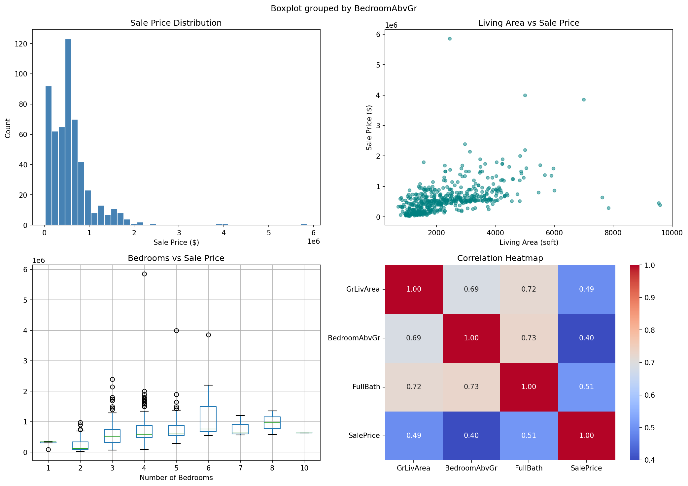
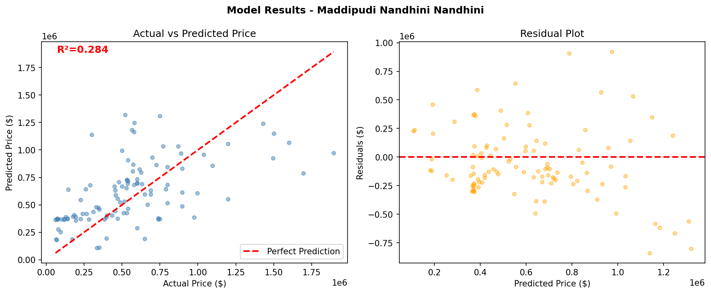

# SkillCraft Technology — Machine Learning Internship Task 1

**Project Title**

House Price Prediction using Linear Regression

**Objective**

To implement a Linear Regression model to predict house prices based on square footage, number of bedrooms, and number of bathrooms.

**Tools Used**

- Python
- Pandas
- NumPy
- Matplotlib & Seaborn
- Scikit-learn

**Dataset**

House Prices Dataset - 535 records

**What I Did**

1. Loaded and explored the dataset
2. Performed Exploratory Data Analysis (EDA)
3. Applied Feature Engineering
4. Split data 80% train and 20% test
5. Trained Linear Regression model
6. Evaluated using R², RMSE and MAE

**Key Insights**

- Living area is the strongest predictor of house price
- More bedrooms and bathrooms increase the price
- Linear Regression works well for this dataset

**Project Files**
**Project Files**

- House_Price_Prediction.ipynb
- eda_analysis.png
- model_results.png
- README.md

## EDA Analysis

## Model Results

**Author**

MADDIPUDI NANDHINI

Machine Learning Intern @ SkillCraft Technology
